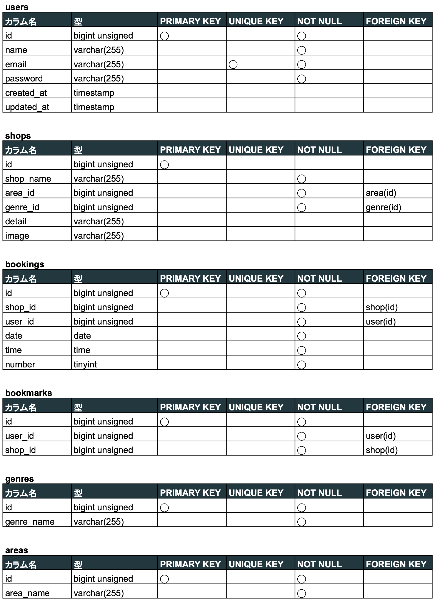
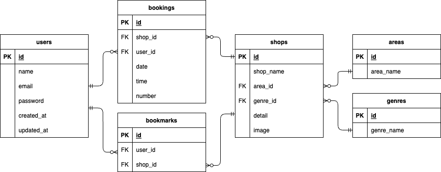

# Rese（リーズ）
飲食店予約アプリケーションです。
飲食店の予約・予約変更と、お気に入りの登録をすることができます。


## 作成した目的
勉強中のフレームワーク（Laravel）のアウトプット

## 機能一覧
ログイン機能、飲食店一覧表示、飲食店検索、飲食店予約・予約変更・予約削除、お気に入り登録・削除

## 使用技術(実行環境)
- PHP7.4.9
- Laravel8.83.27
- MySQL8.0.26

## テーブル設計


## ER図


## 環境構築
**Dockerビルド**
1. `git clone git@github.com:hstonewell/mock_second.git`
2. DockerDesktopアプリを立ち上げる
3. `docker-compose up -d --build`

**Laravel環境構築**
1. `docker-compose exec php bash`
2. `composer install`
3. 「.env.example」ファイルを 「.env」ファイルに命名を変更。または、新しく.envファイルを作成
4. .envに以下の環境変数を追加
``` text
DB_CONNECTION=mysql
DB_HOST=mysql
DB_PORT=3306
DB_DATABASE=laravel_db
DB_USERNAME=laravel_user
DB_PASSWORD=laravel_pass
```
5. アプリケーションキーの作成
``` bash
php artisan key:generate
```

6. マイグレーションの実行
``` bash
php artisan migrate
```

7. シーディングの実行
``` bash
php artisan db:seed
```

## URL
- 開発環境：http://localhost/
- phpMyAdmin:：http://localhost:8080/
