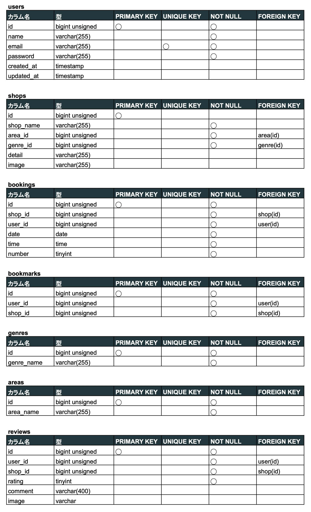
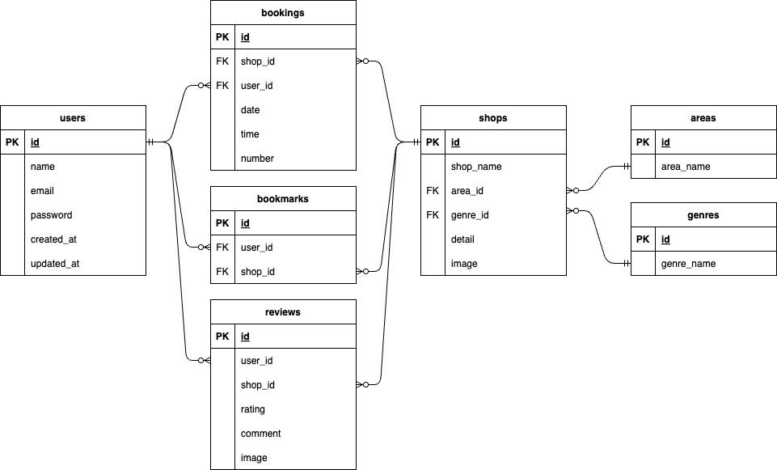
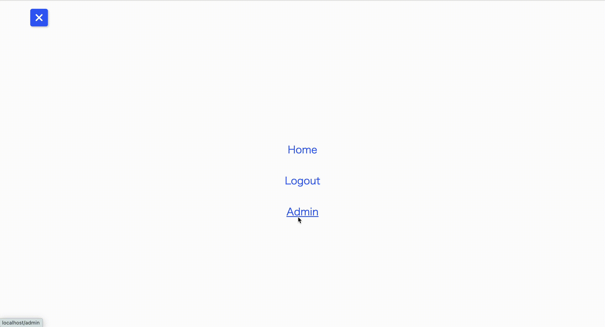
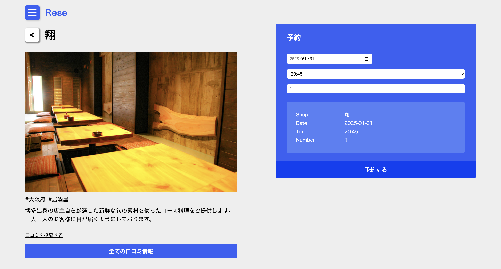

# Rese（リーズ）
飲食店予約アプリケーションです。
飲食店の予約・予約変更と、お気に入りの登録をすることができます。


## 作成した目的
勉強中のフレームワーク（Laravel）のアウトプット

## 機能一覧
ログイン機能、飲食店一覧表示、飲食店検索、飲食店予約・予約変更・予約削除、お気に入り登録・削除

## 使用技術(実行環境)
- PHP7.4.9
- Laravel8.83.27
- MySQL8.0.26

## テーブル設計


## ER図


## 環境構築
**Dockerビルド**
1. `git clone git@github.com:hstonewell/mock_second.git`
2. DockerDesktopアプリを立ち上げる
3. `docker compose up -d --build`

**Laravel環境構築**
1. `docker compose exec php bash`
2. `composer install`
3. 「.env.example」ファイルを 「.env」ファイルに命名を変更。または、新しく.envファイルを作成
4. .envに以下の環境変数を追加
``` text
DB_CONNECTION=mysql
DB_HOST=mysql
DB_PORT=3306
DB_DATABASE=laravel_db
DB_USERNAME=laravel_user
DB_PASSWORD=laravel_pass
```
5. アプリケーションキーの作成
``` bash
php artisan key:generate
```

6. マイグレーションの実行
``` bash
php artisan migrate
```

7. シーディングの実行
``` bash
php artisan db:seed
```

7. シンボリックリンクの作成
``` bash
php artisan storage:link
```

## 店舗情報の一括追加方法
管理ユーザーはCSVファイルから店舗情報を一括登録することができます。

**CSVファイルのアップロード方法**

1. 管理ユーザとしてログインし、メニューからadmin画面へ
2. 左側のボタンをクリックしCSVファイルをアップする
3. 右側のボタン「インポート」をクリックしファイルをインポート
> [!NOTE]
> ファイル形式が異なる場合はエラーとなります。
> 内容を確認の上再度アップロードしてください。

**CSVファイル記入方法**
1. 任意の場所にcsvファイルを作成もしくは[shop_template.csv](shop_template.csv)をコピー
2. 1行目に下記を記載
```
shop_name,area,genre,detail,image
```
3. 2行目以降にはカンマ区切りで詳細情報を記入
記入例：
``` text
店舗名,地域,ジャンル,店舗概要,http://店舗画像.jpg
```
> [!IMPORTANT]
> - すべての項目は入力必須です。
> - 地域は東京都・大阪府・福岡県のいずれかを入力してください。
> - ジャンルには「寿司」「焼肉」「イタリアン」「居酒屋」「ラーメン」のいずれかを入力してください。

### 管理ユーザのログインデフォルト値
- メールアドレス：admin@testuser.com
- パスワード：Admin-1234

## レビュー投稿
- 一般ユーザは店舗来店予約時間後からその店舗へのレビューを投稿することができます。
- 来店済みの店舗詳細画面にはレビュー投稿用のリンクが出現します。

- 書き込んだあとはレビューを編集・削除することができます。

> [!NOTE]
> - 口コミの投稿は一店舗につき一度までです。
> - 管理ユーザと店舗代表者は口コミの投稿はできません。
> - 管理ユーザはすべての書き込みを削除することができます。


## URL
- 開発環境：http://localhost/
- phpMyAdmin:：http://localhost:8080/
